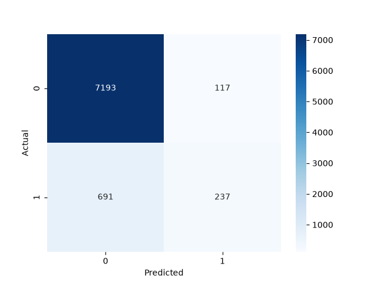
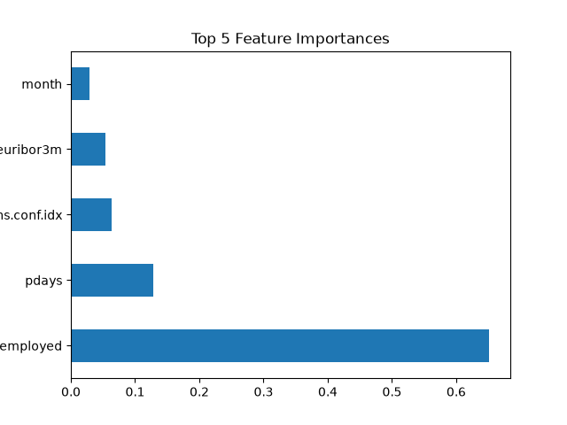

# DS_4_BankMarketing_SHAP_BYTE

**Task:** Decision Tree Classifier with Explainable AI (SHAP) — AVIP 2026, B.Y.T.E by Arithmatrix (Data Science Track, Task 4)

Predicts whether a bank customer will subscribe to a term deposit, and explains *why* each prediction was made using SHAP values instead of a black-box "yes/no" output.

## Dataset

- **Source:** [UCI Machine Learning Repository — Bank Marketing Dataset](https://archive.ics.uci.edu/ml/datasets/Bank+Marketing)
- **File used:** `bank-additional-full.csv` (semicolon-delimited)
- **Extraction date:** *(add the date you downloaded it)*
- 41,188 rows × 21 columns (20 features + target `y`)

## Setup

```bash
python -m venv venv
venv\Scripts\Activate.ps1        # Windows PowerShell
pip install -r requirements.txt
```

Place `bank-additional-full.csv` inside a `data/` folder, then run `notebook.ipynb` top to bottom.

## Preprocessing

- Renamed target column `y` → `subscribed`, mapped `yes`/`no` → `1`/`0`
- Label-encoded all categorical columns (`job`, `marital`, `education`, `contact`, `month`, `poutcome`, etc.)
- **Dropped `duration`** — this column records the length of the last phone call, which is only known *after* the call ends (and therefore after the outcome is already effectively determined). The UCI dataset documentation itself flags this as a leakage risk for realistic predictive modeling, so it was excluded to keep the model usable for genuine pre-contact prediction rather than inflating accuracy artificially.
- 80/20 stratified train/test split (`random_state=42`)

## Model

- `DecisionTreeClassifier(max_depth=5, random_state=42)` from scikit-learn
- Depth capped at 5 to keep the tree interpretable and to keep SHAP explanations concise

## Evaluation Metrics (test set)

| Metric    | Score  |
|-----------|--------|
| Accuracy  | 90.19% |
| Precision | 66.95% |
| Recall    | 25.54% |



The model is precise but conservative — when it predicts "will subscribe," it's right about two-thirds of the time, but it misses roughly three-quarters of actual subscribers (low recall). This trade-off is typical for imbalanced marketing datasets, where the "no" class heavily outnumbers "yes."

## Top 5 Feature Importances

| Rank | Feature        | Importance |
|------|----------------|-----------|
| 1    | nr.employed    | 0.652     |
| 2    | pdays          | 0.128     |
| 3    | cons.conf.idx  | 0.064     |
| 4    | euribor3m      | 0.054     |
| 5    | month          | 0.029     |



`nr.employed` (number of employees in the economy, a macroeconomic indicator) dominates the model's decisions by a wide margin — suggesting subscription behavior is driven more by broad economic conditions than by individual customer demographics in this dataset.

## Explainable AI (SHAP)

SHAP (`TreeExplainer`) values were computed for every test prediction, and a helper function converts the top contributing features into a plain-language sentence rather than a bare label.

Example outputs:
```
User will NOT buy because contact = 0 and euribor3m = 4.961.
User will NOT buy because nr.employed = 5076.2 and contact = 0.
```

*(Note: categorical values are shown as their encoded integers, e.g. `contact = 0`. Optionally map these back to original labels via the stored `LabelEncoder` objects for more readable output.)*

## Model Summary

The decision tree achieves 90% accuracy but leans heavily on macroeconomic indicators (`nr.employed`, `euribor3m`, `cons.conf.idx`) rather than individual customer attributes to predict subscription. Precision (67%) is reasonably strong, meaning positive predictions are fairly trustworthy, but recall (26%) is low, meaning many genuine subscribers are missed. This is a common trade-off in imbalanced classification and would benefit from class-weighting or resampling (e.g., SMOTE) in a follow-up iteration. Removing the `duration` feature was a deliberate choice to avoid data leakage, making this a more realistic pre-contact prediction model rather than an inflated post-hoc one.

## Deliverables

- `notebook.ipynb` — full preprocessing, training, evaluation, and SHAP code
- `outputs/confusion_matrix.png`
- `outputs/feature_importance.png`
- `requirements.txt`
- This README

## Tech Stack

Python · pandas · scikit-learn · SHAP · matplotlib · seaborn
